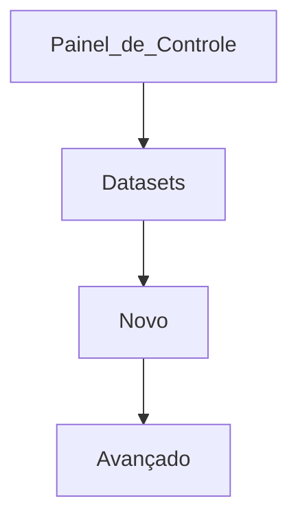

# Manipulação de datasets

# Índice

1. [Pré-requisitos](#1-pré-requisitos)
2. [Criação de Datasets](#2-criação-de-Datasets)
3. [Estrutura base de um dataset](#3-estrutura-base-de-um-dataset)
4. [Fazendo Mudanças e Commit](#4-tipos-de-dataset)
5. [Codando seu dataset](#5-codando-seu-dataset)
6. [Elementos específicos do FLUIG](#6-elementos-específicos-do-FLUIG)
7. [Utilização de datasets em WIDGETS](#7-utilização-de-datasets-em-WIDGETS)
8. [Adquirir informações de formulários com tabela pai-filho](#8-adquirir-informaçõe-de-formulários-com-tabela-paifilho)
9. [Utilização de Datasets externamente](#9-Utilização-de-Datasets-externamente)
10. [Utilizando SOAP Datasets externos](#10-Utilizando-SOAP-Datasets-externos)

---

## 1. Pré-requisitos

Antes de começar, caso você deseja *criar* um dataset certifique-se de que o própio será upado em um servidor do *FLUIG*. Existem 3 servidores principais para gerir datasets [Homologação](http://192.168.2.15:8080/portal/p/01/wcmdatasetpage),da [Produção](http://fluigtsm.com.br/portal/p/01/wcmdatasetpage?controlpanelsearch=true) e do [Lab](https://lab.fluig.com/portal/p/01_academy/wcmdatasetpage).

> [!NOTA]
> Os acessos do [Lab](lab.fluig.com) são:
>##### Usuário: **academy.aluno**
>##### Senha: **academy.aluno**

---

## 2. Criação de Datasets

Para criar datasets, você deve:

1. Clicar com o botão direito na pasta que desejar
2. New
3. Dataset Costumizado
4. Insira o Código(Nome) do dataset
> Utilizamos a formatação ```dsNomeDoDataset```
5. Insira a descrição(funcionalidade) do dataset
> Para descrever a funcionalidade utilize ```dsNomeDoDataset - descrição da funcionalidade do dataset```
---

## 3. Estrutura base de um dataset

O dataset será aberto no Eclipse dessa forma:
```JS
function defineStructure() {

}
function onSync(lastSyncDate) {

}
function createDataset(fields, constraints, sortFields) {

}function onMobileSync(user) {

}
```
# Onde 
1. ```defineStructure()``` é a função base que define a estrutura do retorno do dataset
2. ```onSync(lastSyncDate)``` é a função base para a sincronização de dados com o servidor. Ela será chamada a cada execução do dataset com uma tarefa agendada definida.
3. ```createDataset(fields, constraints, sortFields)``` é a função que armazenará todo o código do seu dataset.
4. ```onMobileSync(user)``` é uma função chamada apenas durante a atualização de um dataset offline já existente. Para evitar o uso desnecessário de armazenamento mobile
---

## 4. Tipos de dataset

O dataset pode ser estruturado para ser *simples*, *avançado* ou *sincronizado*

# Dataset Simples
São datasets feitos para retorno de uma tabela com colunas e linhas de determinados dados específicos que você deseja, sejam de outros datasets internos/avançados ou de integrações. (Eles são construidos usando lowcode)

# Dataset Avançado
São datasets que podem ser feitos para retornar uma tabela com informações de outros datasets/formulários do FLUIG. Além de serem capazes de fazer integrações com outros sistemas disponíveis e adquirir informações destes. Eles, possuem menos limitações de funcionalidades e podem utilizar do ```console.log() ``` para fazer o controle de retornos. Este log também pode ser acessado baixando o zip do controle de log da [Homologação](http://192.168.2.15:8080/portal/p/01/wcmlogcontrolpage) ou da [Produção](http://fluigtsm.com.br/portal/p/01/wcmlogcontrolpage)
***Caminho***



# Dataset Sincronizado
São datasets avançados que rodam com uma agenda específica (de minuto em minuto ou até em dias específicos da semana). Eles geralmente são feitos para aqueles com tarefas que requisitam constante atualização de dados de integrações/api's/formulários. Eles possuem uma estrutura de construção parecida com os datasets avançados

---

## 5. Codando seu dataset
A estrutura de um retorno de dataset sempre será de uma tabela. Com colunas e linhas com dados que o desenvolvedor desejar.
Podem ser dados chumbados(pré-determinados) com informações que específicas

```JS
function defineStructure() {

}
function onSync(lastSyncDate) {

}
function createDataset(fields, constraints, sortFields) {
	var ds = DatasetBuilder.newDataset(); // aqui é estruturado o serviço que constroe o dataset
	ds.addColumn("Coluna 1"); // sendo ds.addColumn("") responsável pela construção da coluna
	ds.addColumn("Coluna 2");
	
	ds.addRow(new Array("Valor1", "Valor2")); // ds.addRow("") responsável pela construção das linhas
	ds.addRow(new Array("Valor3", "Valor4"));
	ds.addRow(new Array("Valor5", "Valor6"));
	
	return ds; // retorna a estrutura do dataset construido
}function onMobileSync(user) {

}
```

Podem ser dados de datasets internos(registros de formulários)
O acesso a um Dataset, seja interno/avançado/sincronizado é feito através do método getDataset do objeto DatasetFactory

```JS
    var retornoDoDataset = DatasetFactory.getDataset('Nome do dataset', campos, constraints, ordem);
```
Onde seus parâmetros são:

- Nome do Dataset: Nome do Dataset a ser buscado;
- Campos: Array com os campos do Dataset que serão retornados. Caso seja informado null, retorna todos os campos do Dataset;
- Constraints: Array com os condições de busca do Dataset. Caso seja informado null, retorna todos os registros do Dataset.
- Ordem: Array com os campos para ordenação dos registros do Dataset. Caso seja informado null, retorna os registros com a ordenação padrão.

Já para a criação das constraints é utilizado o método createConstraint do objeto DatasetFactory

```JS
var constraint = DatasetFactory.createConstraint("Campo", "ValorInicial", "ValorFinal", Tipo);
```
Onde seus parâmetros são:

- Campo: Nome do campo que será filtrado;
- Valor Inicial: Valor inicial da faixa de valores do filtro
- Valor Final: Valor final da faixa de valores do filtro
- Tipo: Tipo da condição, podendo ser:
> *MUST: indica que todos os registros do Dataset devem satisfazer a esta condição.*
> *SHOULD: indica que os registros do Dataset podem ou não atender à condição. Esse tipo é mais comum quando se necessita que um mesmo campo tenha valores A ou B (onde cada um será uma condição de busca com tipo SHOULD).*
> *MUST_NOT: indica que nenhum dos registros pode satisfazer a condição*

Uma estrutura de dataset que consume outro dataset para ser construido deve ser algo parecido com:

```JS
function defineStructure() {

}
function onSync(lastSyncDate) {

}
function createDataset(fields, constraints, sortFields) {
	var ds = DatasetBuilder.newDataset();
	ds.addColumn("Nome")//Coluna de Nomes
	ds.addColumn("Dia e hora da reunião")//Coluna de informações de uma reunião
	var c1 = DatasetFactory.createConstraint("metadata#active", true, true, ConstraintType.MUST) //Crio uma constrant e pego os registros ativos(mais atualizados)
    var filtro = new Array(c1);//crio o filtro para a chamado
    var dsInterno = DatasetFactory.getDataset('dsFORMPRIN', null, filtro, null);//consulto o dataset passando um filtro com as informações que eu quero
    if (dsInterno.rowsCount > 0) {                                              //verifico se algo retornou da chamada
		for (var i = 0; i < dsInterno.rowsCount; i++) {							//caso retornou, consulto os dados
			ds.addRow(new Array(
				dsInterno.getValue(i, 'arq'),									//com os dados do dataset interno, construo uma tabela
				dsInterno.getValue(i, 'diaehora')
				));
		}
	}
	return ds;

}function onMobileSync(user) {

}
```
Datasets possuem a capacidade de requisitar dados com campos com nomes expecíficos em suas chamadas e, caso não sejam passados, atribuir um valor base.
A estrutura abaixo foi feita o objetivo dele funcionar com ou sem valores passados na chamada

```JS
    ///
    function createDataset(fields, constraints, sortFields) {
        var id = "306028"; // variavel que servira de padrão, caso a chamada não passe nenhum valor
        if (constraints !== null) { //verifico se uma constraint foi passada
            for (var i = 0; i < constraints.length; i++) {
                if (constraints[i].fieldName == "id") {
                    id = constraints[i].initialValue; // variavel padrão é alterada para o valor que foi passado na chamada
                }
            }
        }
    ///
```

---

## 6. Elementos específicos do FLUIG
Na [documentação](https://tdn.totvs.com/display/public/fluig/Central+de+ajuda) é possivel ver que existem metadados e diferentes tipos de informações que possuem definidos retornos que podem ajudar no desenvolvimento do dataset.
# Sendo os principais:

1. **metadata#active**
> *Campo boolean que só é true quando os registros são ativos (formuláriosatualizados e disponíveis no ECM do FLUIG)*

```JS
var c1 = DatasetFactory.createConstraint("metadata#active", true, true, ConstraintType.MUST)
```

2. **documentId**
> *Campo string que representa o id do documento (todos os registros ativos e não ativos do FLUIG possuem)*

```JS
var c1 = DatasetFactory.createConstraint("documentId", "8888", "8888", ConstraintType.MUST)
```

3. **tableid**
> *Campo string que representa o nome/id da tabela pai-filho do documento (se ele possuir)*

```JS
var c1 = DatasetFactory.createConstraint("tableid", "nomeTabela", "nomeTabela", ConstraintType.MUST) //GERALMENTE O NOME DA TABELA É "principal"
```

4. **sqlLimit**
> *Campo string que representa a limitação de números de registros. Geralmente é usado em buscas de datasets com MUITAS linhas*

```JS
var c1 = DatasetFactory.createConstraint("sqlLimit", "100", "100", ConstraintType.MUST)
```

5. **WKCompany**
> *Campo int que retorna o código da empresa*

```JS
var companyId = getValue("WKCompany");
```

6. **WKUser**
> *Campo string que retorna o usuário logado*

```JS
var currentUser = getValue("WKUser");
```
---

## 7. Utilização de datasets em WIDGETS

Portais que desejam utilizar, enviar ou manipular informações de datasets precisam de ter um arquivo *js*. Este arquivo deve estar localizado na pasta da widget ( nomeWidget > src > main > webapp > resources > js ).
É necessário, pois sem essa "biblioteca", os comandos de dataset não funcionam

```JS
<script type="text/javascript" src="/webdesk/vcXMLRPC.js"></script>
```

---

## 8. Adquirir informações de formulários com tabela paiFilho

São exigidos o nome/id da ```tablename```, o número do formulário e o número da versão do documento para extrair todos as linhas de uma tabela pai-filho

```JS
function createDataset(fields, constraints, sortFields) {
     
    //Cria as colunas
    var dataset = DatasetBuilder.newDataset();
    dataset.addColumn("NumFormulario");
    dataset.addColumn("Id");
    dataset.addColumn("Peca");
    dataset.addColumn("Quantidade");
     
    //Cria a constraint para buscar os formulários ativos
    var cst = DatasetFactory.createConstraint("metadata#active", true, true, ConstraintType.MUST);
    var constraints = new Array(cst);
     
    var datasetPrincipal = DatasetFactory.getDataset("dsExemploPaiFilho", null, constraints, null);
     
    for (var i = 0; i < datasetPrincipal.rowsCount; i++) {
        var documentId = datasetPrincipal.getValue(i, "metadata#id");
        var documentVersion = datasetPrincipal.getValue(i, "metadata#version");
         
        //Cria as constraints para buscar os campos filhos, passando o tablename, número da formulário e versão
        var c1 = DatasetFactory.createConstraint("tablename", "tabelaPecas" ,"tabelaPecas", ConstraintType.MUST);
        var c2 = DatasetFactory.createConstraint("metadata#id", documentId, documentId, ConstraintType.MUST);
        var c3 = DatasetFactory.createConstraint("metadata#version", documentVersion, documentVersion, ConstraintType.MUST);
        var constraintsFilhos = new Array(c1, c2, c3);
 
        //Busca o dataset
        var datasetFilhos = DatasetFactory.getDataset("dsExemploPaiFilho", null, constraintsFilhos, null);
 
        for (var j = 0; j < datasetFilhos.rowsCount; j++) {
            //Adiciona os valores nas colunas respectivamente.
            dataset.addRow(new Array(
                    documentId,
                    datasetFilhos.getValue(j, "wdk_sequence_id"),
                    datasetFilhos.getValue(j, "peca"), 
                    datasetFilhos.getValue(j, "qtde")));
        }
    }
     
    return dataset;
}
```
---

## 9. Utilização de Datasets externamente

Caso seja desenvolvido um portal para uma pessoa que não tem acesso ao FLUIG, é possivel construir uma widget sem necessidade de cadastro.
Porém a construção do script do portal deve ser diferente, pois o arquivo ``vcXMLRPC.js`` não irá funcionar sem o login do usuário no FLUIG.
# Será necessário para funcionar:

- Informações do cadastro do OAuth application completos

```JS
	var oauth = OAuth({
		consumer: {
			'key': '', // Consumer key do OAuth application
			'secret': '' // Consumer secret do OAuth application
		},
		signature_method: 'HMAC-SHA1',
		hash_function(base_string, key) {
			return CryptoJS.HmacSHA1(base_string, key).toString(CryptoJS.enc.Base64);
		},
		nonce_length: 6
	});
	var request_data = {
        // url: 'http://http://fluigtsm.com.br/api/public/ecm/dataset/search' //api publica de busca de dataset da homologação.
		url: 'http://192.168.2.15:8080/api/public/ecm/dataset/search', //api publica de busca de dataset da homologação.
		method: 'GET' //POST, PUT
	};
	//type of the constraint(1 - MUST, 2 - SHOULD, 3 - MUST_NOT)
	var data = {
		"datasetId": "nomeDataset" //nome do dataset
	}
	var token = {
        'key': '',// Access token do OAuth application
        'secret': ''// Token secret do OAuth application
    }
	$.ajax({
		url: request_data.url,
		contentType: 'application/json',
		crossDomain: true,
		type: request_data.method,
		data: JSON.stringify(data),
		headers: oauth.toHeader(oauth.authorize(request_data, token))
	}).done(function (response) {//response é o retorno do dataset

    }).fail(function (error){

    })
```
## 10. Utilizando SOAP Datasets externos

A estrutura do SOAP de um script de uma widget sem necessidade de login:

```JS
function criaRegistro() {
    var _xml;
    var nome = $("#nome").val()
    var email = $("#email").val();
    var IdExemplo = $("#IdExemplo").val();
    if (nome === "") {
        alert("O campo 'Nome' é obrigatório. Preencha antes de enviar.");
    } else {
        //simulação de construção de um arquivo XML (envelope soap)
        let _xml = '<soapenv:Envelope xmlns:soapenv="http://schemas.xmlsoap.org/soap/envelope/" xmlns:ws="URL DE WORKFLOW DA EMPRESA">'
            + '<soapenv:Header/>'
            + '<soapenv:Body>'
            + '<ws:######>' //tipo do envelope
            + '<username>##########</username>' //login de acesso do sistema
            + '<password>##########</password>' //senha de acesso do sistema
            + '<companyId>####</companyId>' //numero da compania
            + '<processId>######</processId>' //nome do processo no sistema
            + '<comments></comments>'
            + '<attachments>'
            + '</attachments>'
            + '<cardData>'
            + '<item>'
            + '<item>IdExemplo</item>' //id do formulário
            + '<item>' + IdExemplo + '</item>' //variavel que adquirimos
            + '</item>'
        var linhas = document.getElementsByClassName('table')[1].getElementsByTagName('tr');
        var totalLinhas = linhas.length;
        // adicionamos elementos de uma tabela de um formulário
        for (var i = 1; i < totalLinhas - 1; i++) {
            var nome = $("#nome" + i).val();
            var email = $("#email" + i).val();
            _xml += '<item>'
                + '<item>nome' + i + '</item>'
                + '<item>' + nome + '</item>'
                + '</item>'
            _xml += '<item>'
                + '<item>email' + i + '</item>'
                + '<item>' + email + '</item>'
                + '</item>'
        }
        _xml += '</cardData>'
            + '</ws:#####>' //tipo do envelope
            + '</soapenv:Body>'
            + '</soapenv:Envelope>';
        let urlWsEditar = WCMAPI.getServerURL() +
            '#######'//url de serviço
        $.ajax({
            type: "POST", //"MÉTODO DE INICIAR UM PROCESSO E CRIAR UM REGISTRO DE FORMULÁRIO"
            dataType: "xml", //TIPO DO ARQUIVO DO ENVELOPE
            url: urlWsEditar,
            data: _xml,
            crossDomain: true, //se requisição que não é de um mesmo domínio
            success: function (data) {
                var oauth = OAuth({
                    consumer: {
                        'key': '###', // Consumer key do OAuth application
                        'secret': '###' // // Consumer secret do OAuth application
                    },
                    signature_method: 'HMAC-SHA1',
                    hash_function: function (base_string, key) {
                        return CryptoJS.HmacSHA1(base_string, key).toString(CryptoJS.enc.Base64);
                    },
                    nonce_length: 6
                });
                var data = {
                    "name": "#####", //nome do dataset
                    "constraints": [
                        { "_field": "IdExemplo", "_initialValue": IdExemplo, "_finalValue": IdExemplo, "_type": 1, "_likeSearch": false }// construção de uma constraint
                    ]
                }
                // Adicionando os valores de elementos de uma tabela pai filho na widget, nesse exemplo de 2 colunas de nome e email
                for (var i = 1; i < totalLinhas - 1; i++) {
                    var nome = $("#nome" + i).val();
                    var email = $("#email" + i).val();
                    data.constraints.push(
                        { "_field": "nome" + i, "_initialValue": nome, "_finalValue": nome, "_type": 1, "_likeSearch": false }
                    );
                    data.constraints.push(
                        { "_field": "email" + i, "_initialValue": email, "_finalValue": email, "_type": 1, "_likeSearch": false }
                    );
                }
                $.ajax({
                    url: request_data.url,
                    contentType: 'application/json',
                    crossDomain: true,
                    type: request_data.method,
                    data: JSON.stringify(data), //transforma a data em json e envia
                    headers: oauth.toHeader(oauth.authorize(request_data, token))
                }).done(function (response) {
                    FLUIGC.toast({
                        title: 'Processo Iniciado!',
                        message: 'Após a reunião, continue o processo',
                        type: 'success'
                    });
                    $("#sucesso").show();
                    $("#formulario").hide();
                    sucesso()
                })
            },
            error: function () {
                FLUIGC.toast({
                    title: 'Aconteceu Algo de errado!',
                    message: 'Tente novamente, ou comunique o suporte!',
                    type: 'danger'
                });
            }
        });
    }
}
```
